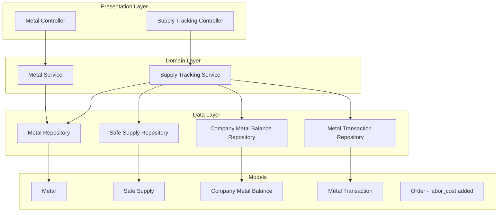
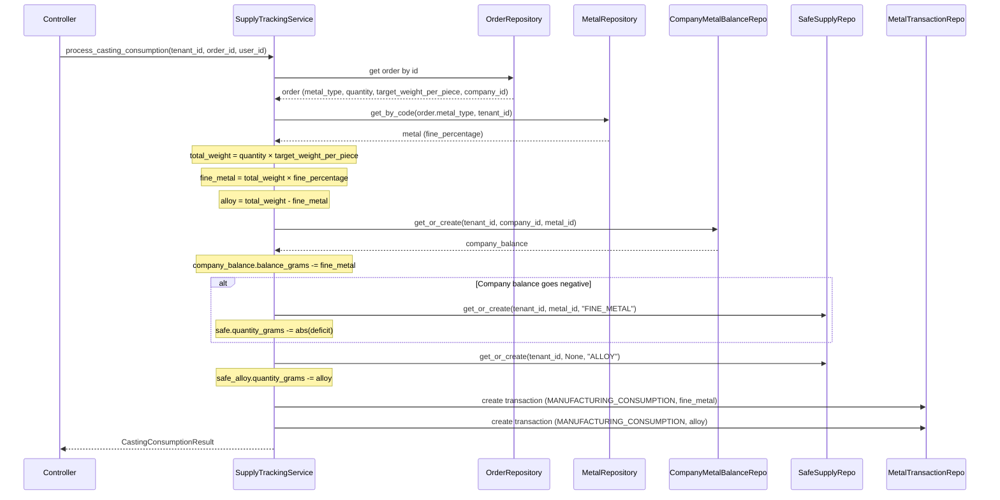

# Design Document: Metal Supply Tracking

## Overview

This feature adds comprehensive metal supply tracking to the JMSK jewelry manufacturing system. It introduces a dedicated `Metal` entity (replacing the simple string-based metal_type lookup), per-company metal balance ledgers, a manufacturer "safe" inventory, and automatic metal consumption calculations during the casting manufacturing step.

The core business flow:
1. Companies deposit fine metal (e.g., 24K gold) → increases their balance and the safe
2. The manufacturer purchases fine metal and alloy → increases the safe
3. During casting, the system calculates how much fine metal and alloy is needed based on target karat and weight
4. Fine metal is subtracted from the company's balance; alloy is subtracted from the safe
5. If a company's balance goes negative, the deficit comes from the manufacturer's safe

The feature follows the existing Clean Architecture pattern: Presentation (controllers) → Domain (services) → Data (repositories/models), with multi-tenant isolation enforced at every layer.

## Architecture



### Key Design Decisions

1. **Separate Metal entity from LookupValues**: Metals need fine_percentage and cost tracking which don't fit the generic LookupValue schema. The metal_type lookup category remains for backward compatibility but the Metal table is the source of truth for calculations.

2. **Transaction ledger pattern**: Every balance change creates an immutable Metal_Transaction record. This provides a full audit trail and allows balance reconstruction from transactions if needed.

3. **Casting step triggers calculations**: Only the "CASTING" step_type triggers automatic metal consumption. Other manufacturing steps track weight but don't adjust metal balances. This is checked by comparing the step's `step_type` against the "CASTING" code.

4. **Alloy tracked without metal_id**: Alloy is a generic non-precious material. Safe_Supply records with `metal_id=NULL` and `supply_type="ALLOY"` represent alloy inventory. This avoids creating a fake Metal record for alloy.

5. **Weighted average cost**: When purchasing metal, the average_cost_per_gram is updated using a weighted average: `new_avg = (old_avg * old_qty + purchase_cost * purchase_qty) / (old_qty + purchase_qty)`.

6. **Role check via role name**: Manager+ access is enforced by checking `current_user.role.name` against allowed role names (e.g., "admin", "manager"). This aligns with the existing RBAC pattern using the Role model.

## Components and Interfaces

### Backend Components

#### 1. Metal Controller (`app/presentation/api/v1/controllers/metal_controller.py`)

```python
# Routes registered at /api/v1/metals
GET    /                  → list_metals(include_inactive: bool = False)
POST   /                  → create_metal(data: MetalCreate)         # manager+
GET    /{metal_id}        → get_metal(metal_id: int)
PUT    /{metal_id}        → update_metal(metal_id: int, data: MetalUpdate)  # manager+
DELETE /{metal_id}        → deactivate_metal(metal_id: int)         # manager+
```

#### 2. Supply Tracking Controller (`app/presentation/api/v1/controllers/supply_tracking_controller.py`)

```python
# Routes for metal balance operations
POST   /api/v1/companies/{company_id}/metal-deposits
       → record_deposit(company_id: int, data: MetalDepositCreate)

GET    /api/v1/companies/{company_id}/metal-balances
       → get_company_balances(company_id: int)

POST   /api/v1/safe/purchases
       → record_purchase(data: SafePurchaseCreate)

GET    /api/v1/safe/supplies
       → get_safe_supplies()

GET    /api/v1/metal-transactions
       → list_transactions(company_id: Optional[int], metal_id: Optional[int], 
                           transaction_type: Optional[str])
```

#### 3. Metal Service (`app/domain/services/metal_service.py`)

```python
class MetalService:
    def __init__(self, db: Session):
        self.repository = MetalRepository(db)

    def get_all(self, tenant_id: int, include_inactive: bool = False) -> List[MetalResponse]
    def get_by_id(self, metal_id: int, tenant_id: int) -> MetalResponse
    def get_by_code(self, code: str, tenant_id: int) -> Metal  # Returns ORM model for internal use
    def create(self, data: MetalCreate, tenant_id: int) -> MetalResponse
    def update(self, metal_id: int, data: MetalUpdate, tenant_id: int) -> MetalResponse
    def deactivate(self, metal_id: int, tenant_id: int) -> MetalResponse
    def seed_defaults(self, tenant_id: int) -> None
```

#### 4. Supply Tracking Service (`app/domain/services/supply_tracking_service.py`)

```python
class SupplyTrackingService:
    def __init__(self, db: Session):
        self.metal_repo = MetalRepository(db)
        self.safe_repo = SafeSupplyRepository(db)
        self.balance_repo = CompanyMetalBalanceRepository(db)
        self.transaction_repo = MetalTransactionRepository(db)
        self.db = db

    # Company deposits
    def record_company_deposit(
        self, tenant_id: int, company_id: int, metal_id: int,
        quantity_grams: float, user_id: int, notes: Optional[str] = None
    ) -> MetalTransactionResponse

    # Safe purchases
    def record_safe_purchase(
        self, tenant_id: int, metal_id: Optional[int], supply_type: str,
        quantity_grams: float, cost_per_gram: float, user_id: int,
        notes: Optional[str] = None
    ) -> MetalTransactionResponse

    # Casting consumption (called from manufacturing step completion)
    def process_casting_consumption(
        self, tenant_id: int, order_id: int, user_id: int
    ) -> CastingConsumptionResult

    # Queries
    def get_company_balances(self, tenant_id: int, company_id: int) -> List[CompanyMetalBalanceResponse]
    def get_safe_supplies(self, tenant_id: int) -> List[SafeSupplyResponse]
    def get_transactions(self, tenant_id: int, filters: TransactionFilter) -> List[MetalTransactionResponse]

    # Internal calculation
    def _calculate_casting_consumption(
        self, total_weight: float, fine_percentage: float
    ) -> tuple[float, float]:
        """Returns (fine_metal_grams, alloy_grams)"""
        fine_metal_grams = total_weight * fine_percentage
        alloy_grams = total_weight - fine_metal_grams
        return fine_metal_grams, alloy_grams
```

#### 5. Repositories

```python
class MetalRepository(BaseRepository[Metal]):
    def get_by_code(self, code: str, tenant_id: int) -> Optional[Metal]
    def code_exists(self, tenant_id: int, code: str) -> bool
    def get_active(self, tenant_id: int) -> List[Metal]

class SafeSupplyRepository(BaseRepository[SafeSupply]):
    def get_or_create(self, tenant_id: int, metal_id: Optional[int], supply_type: str) -> SafeSupply
    def get_all_for_tenant(self, tenant_id: int) -> List[SafeSupply]

class CompanyMetalBalanceRepository(BaseRepository[CompanyMetalBalance]):
    def get_or_create(self, tenant_id: int, company_id: int, metal_id: int) -> CompanyMetalBalance
    def get_by_company(self, tenant_id: int, company_id: int) -> List[CompanyMetalBalance]

class MetalTransactionRepository(BaseRepository[MetalTransaction]):
    def get_filtered(self, tenant_id: int, filters: TransactionFilter) -> List[MetalTransaction]
```

### Frontend Components

#### 1. MetalsPage (`src/pages/Metals.tsx`)
- Table displaying Metal records with code, name, fine percentage (as %), average cost
- Add/Edit/Deactivate controls visible only to manager+ roles
- Uses `useMetals()` hook for data fetching

#### 2. CompanyMetalBalances (`src/components/CompanyMetalBalances.tsx`)
- Displayed on company detail page
- Table of per-metal balances with negative highlighting
- "Record Deposit" button for managers

#### 3. MetalDepositModal (`src/components/MetalDepositModal.tsx`)
- Form: select metal, enter quantity in grams
- Validates positive quantity

#### 4. Hooks
- `useMetals()` - CRUD operations for Metal records
- `useCompanyMetalBalances(companyId)` - fetch company balances
- `useSafeSupplies()` - fetch safe inventory
- `useMetalTransactions(filters)` - fetch transaction history

## Data Models

### Metal

```python
class Metal(Base):
    __tablename__ = "metals"
    __table_args__ = (
        UniqueConstraint('tenant_id', 'code', name='uq_metal_code_per_tenant'),
    )

    id = Column(Integer, primary_key=True, index=True)
    tenant_id = Column(Integer, ForeignKey("tenants.id"), nullable=False, index=True)
    code = Column(String(50), nullable=False)          # e.g., "GOLD_24K"
    name = Column(String, nullable=False)               # e.g., "Gold 24K"
    fine_percentage = Column(Float, nullable=False)      # 0.0 to 1.0
    average_cost_per_gram = Column(Float, nullable=True)
    is_active = Column(Boolean, default=True, nullable=False)
    created_at = Column(DateTime, default=datetime.utcnow)
    updated_at = Column(DateTime, default=datetime.utcnow, onupdate=datetime.utcnow)

    tenant = relationship("Tenant", back_populates="metals")
```

### SafeSupply

```python
class SafeSupply(Base):
    __tablename__ = "safe_supplies"
    __table_args__ = (
        UniqueConstraint('tenant_id', 'metal_id', 'supply_type', name='uq_safe_supply'),
    )

    id = Column(Integer, primary_key=True, index=True)
    tenant_id = Column(Integer, ForeignKey("tenants.id"), nullable=False, index=True)
    metal_id = Column(Integer, ForeignKey("metals.id"), nullable=True)  # NULL for alloy
    supply_type = Column(String(20), nullable=False)  # "FINE_METAL" or "ALLOY"
    quantity_grams = Column(Float, nullable=False, default=0.0)
    created_at = Column(DateTime, default=datetime.utcnow)
    updated_at = Column(DateTime, default=datetime.utcnow, onupdate=datetime.utcnow)

    tenant = relationship("Tenant")
    metal = relationship("Metal")
```

### CompanyMetalBalance

```python
class CompanyMetalBalance(Base):
    __tablename__ = "company_metal_balances"
    __table_args__ = (
        UniqueConstraint('tenant_id', 'company_id', 'metal_id', name='uq_company_metal_balance'),
    )

    id = Column(Integer, primary_key=True, index=True)
    tenant_id = Column(Integer, ForeignKey("tenants.id"), nullable=False, index=True)
    company_id = Column(Integer, ForeignKey("companies.id"), nullable=False, index=True)
    metal_id = Column(Integer, ForeignKey("metals.id"), nullable=False, index=True)
    balance_grams = Column(Float, nullable=False, default=0.0)
    created_at = Column(DateTime, default=datetime.utcnow)
    updated_at = Column(DateTime, default=datetime.utcnow, onupdate=datetime.utcnow)

    tenant = relationship("Tenant")
    company = relationship("Company")
    metal = relationship("Metal")
```

### MetalTransaction

```python
class MetalTransaction(Base):
    __tablename__ = "metal_transactions"

    id = Column(Integer, primary_key=True, index=True)
    tenant_id = Column(Integer, ForeignKey("tenants.id"), nullable=False, index=True)
    transaction_type = Column(String(30), nullable=False)
        # "COMPANY_DEPOSIT", "MANUFACTURING_CONSUMPTION", "SAFE_PURCHASE", "SAFE_ADJUSTMENT"
    metal_id = Column(Integer, ForeignKey("metals.id"), nullable=True)  # NULL for alloy
    company_id = Column(Integer, ForeignKey("companies.id"), nullable=True)
    order_id = Column(Integer, ForeignKey("orders.id"), nullable=True)
    quantity_grams = Column(Float, nullable=False)  # positive=deposit/purchase, negative=consumption
    notes = Column(Text, nullable=True)
    created_at = Column(DateTime, default=datetime.utcnow)
    created_by = Column(Integer, ForeignKey("users.id"), nullable=False)

    tenant = relationship("Tenant")
    metal = relationship("Metal")
    company = relationship("Company")
    order = relationship("Order")
    user = relationship("User")
```

### Order Model Update

```python
# Add to existing Order model:
labor_cost = Column(Float, nullable=True)  # Manual labor cost entry
```

### Pydantic Schemas

```python
# Metal schemas
class MetalCreate(BaseModel):
    code: str           # Auto-uppercased, validated non-empty
    name: str
    fine_percentage: float  # Validated: 0.0 <= x <= 1.0
    average_cost_per_gram: Optional[float] = None

class MetalUpdate(BaseModel):
    name: Optional[str] = None
    fine_percentage: Optional[float] = None  # Validated: 0.0 <= x <= 1.0
    average_cost_per_gram: Optional[float] = None
    is_active: Optional[bool] = None

class MetalResponse(BaseModel):
    id: int
    tenant_id: int
    code: str
    name: str
    fine_percentage: float
    average_cost_per_gram: Optional[float]
    is_active: bool
    created_at: datetime
    updated_at: datetime

# Deposit / Purchase schemas
class MetalDepositCreate(BaseModel):
    metal_id: int
    quantity_grams: float  # Validated: > 0

class SafePurchaseCreate(BaseModel):
    metal_id: Optional[int] = None  # NULL for alloy
    supply_type: str  # "FINE_METAL" or "ALLOY"
    quantity_grams: float  # Validated: > 0
    cost_per_gram: float   # Validated: >= 0

# Balance / Supply response schemas
class CompanyMetalBalanceResponse(BaseModel):
    id: int
    metal_id: int
    metal_code: str
    metal_name: str
    balance_grams: float

class SafeSupplyResponse(BaseModel):
    id: int
    metal_id: Optional[int]
    supply_type: str
    metal_code: Optional[str]
    metal_name: Optional[str]
    quantity_grams: float

class MetalTransactionResponse(BaseModel):
    id: int
    transaction_type: str
    metal_id: Optional[int]
    metal_code: Optional[str]
    company_id: Optional[int]
    order_id: Optional[int]
    quantity_grams: float
    notes: Optional[str]
    created_at: datetime
    created_by: int

class CastingConsumptionResult(BaseModel):
    fine_metal_grams: float
    alloy_grams: float
    metal_code: str
    company_id: int
    order_id: int
    company_balance_after: float
    safe_fine_metal_after: float
    safe_alloy_after: float
```

### Casting Consumption Flow



### Default Metal Seed Data

| Code | Name | Fine Percentage |
|------|------|----------------|
| GOLD_24K | Gold 24K | 0.999 |
| GOLD_22K | Gold 22K | 0.916 |
| GOLD_18K | Gold 18K | 0.750 |
| GOLD_14K | Gold 14K | 0.585 |
| SILVER_925 | Silver 925 | 0.925 |
| PLATINUM | Platinum | 0.950 |


## Correctness Properties

*A property is a characteristic or behavior that should hold true across all valid executions of a system — essentially, a formal statement about what the system should do. Properties serve as the bridge between human-readable specifications and machine-verifiable correctness guarantees.*

The following properties were derived from the acceptance criteria through prework analysis and redundancy elimination. Each property is universally quantified and suitable for property-based testing.

### Property 1: Fine percentage range validation

*For any* Metal creation or update request, the fine_percentage value SHALL be accepted if and only if it is between 0.0 and 1.0 inclusive. Values outside this range SHALL be rejected with a validation error.

**Validates: Requirements 1.4, 9.7**

### Property 2: Metal code uniqueness per tenant

*For any* tenant and any two Metal records within that tenant, if they share the same code, the second creation SHALL be rejected. Metal records with the same code in different tenants SHALL both be accepted.

**Validates: Requirements 1.2, 9.3**

### Property 3: Metal seed idempotence

*For any* tenant, calling the Metal seed function N times (where N >= 1) SHALL produce the same set of Metal records as calling it exactly once. The count of Metal records after N calls SHALL equal the count after 1 call.

**Validates: Requirements 1.6**

### Property 4: Conservation of mass in casting calculation

*For any* positive total_weight and any fine_percentage in [0, 1], the calculated fine_metal_grams plus alloy_grams SHALL equal total_weight. That is: `fine_metal_grams + alloy_grams == total_weight` where `fine_metal_grams = total_weight * fine_percentage` and `alloy_grams = total_weight - fine_metal_grams`.

**Validates: Requirements 6.1, 6.2**

### Property 5: Deposit dual-update invariant

*For any* company metal deposit of quantity Q grams for metal M, the Company_Metal_Balance for (company, M) SHALL increase by exactly Q, and the Safe_Supply for (metal_id=M, supply_type="FINE_METAL") SHALL also increase by exactly Q.

**Validates: Requirements 3.3, 3.4, 7.1**

### Property 6: Purchase increases safe supply

*For any* safe purchase of quantity Q grams (for either fine metal or alloy), the corresponding Safe_Supply quantity_grams SHALL increase by exactly Q.

**Validates: Requirements 2.3, 2.4, 8.1**

### Property 7: Casting consumption balance adjustments

*For any* casting step completion on an order with metal_type M, quantity N, and target_weight_per_piece W:
- The company's balance for metal M SHALL decrease by `N * W * M.fine_percentage`
- The alloy Safe_Supply SHALL decrease by `N * W * (1 - M.fine_percentage)`
- If the company's balance goes negative, the fine metal Safe_Supply SHALL decrease by the absolute value of the negative balance (the deficit that was previously zero or positive)

**Validates: Requirements 3.5, 2.5, 2.6, 6.5, 6.6, 6.7**

### Property 8: Transaction ledger completeness and sign convention

*For any* balance-modifying operation (deposit, purchase, or casting consumption), a Metal_Transaction record SHALL be created. Transaction quantity_grams SHALL be positive for deposits and purchases, and negative for consumption.

**Validates: Requirements 4.2, 4.3, 4.4, 4.5**

### Property 9: Weighted average cost calculation

*For any* fine metal purchase where the Metal has existing average_cost_per_gram C_old and existing Safe_Supply quantity Q_old, and the purchase is for Q_new grams at cost C_new per gram, the new average_cost_per_gram SHALL equal `(C_old * Q_old + C_new * Q_new) / (Q_old + Q_new)`. If Q_old is 0 (first purchase), the new average SHALL equal C_new.

**Validates: Requirements 8.2**

### Property 10: Non-positive quantity rejection

*For any* deposit or purchase request where quantity_grams is zero or negative, the API SHALL reject the request with a 422 status code and the underlying balances SHALL remain unchanged.

**Validates: Requirements 7.3, 8.4**

### Property 11: Soft delete preserves record

*For any* Metal record that is "deleted" via the API, the record SHALL still exist in the database with is_active set to false. The record SHALL not appear in default (active-only) listings but SHALL appear when include_inactive is true.

**Validates: Requirements 9.6, 9.8**

### Property 12: Role-based write access on metals

*For any* authenticated user, write operations (create, update, deactivate) on Metal records SHALL succeed if and only if the user's role is "manager" or "admin". Read operations SHALL succeed for all authenticated users regardless of role.

**Validates: Requirements 10.1, 10.2, 10.3**

## Error Handling

### Domain Layer Exceptions

All errors follow the existing `DomainException` hierarchy in `app/domain/exceptions.py`:

| Scenario | Exception | HTTP Status |
|----------|-----------|-------------|
| Metal not found | `ResourceNotFoundError` | 404 |
| Duplicate metal code | `DuplicateResourceError` | 400 |
| Invalid fine_percentage | `ValidationError` | 400 |
| Non-positive quantity | `ValidationError` | 422 (via Pydantic) |
| Company not found for deposit | `ResourceNotFoundError` | 404 |
| Invalid metal_type on order | `ValidationError` | 400 |
| Order missing metal_type/weight for casting | Warning logged, no error raised | N/A |
| Insufficient role for write operation | `ForbiddenError` | 403 |

### Controller Error Handling

Controllers follow the existing pattern of catching `DomainException` and converting to `HTTPException`:

```python
try:
    service = MetalService(db)
    return service.create(data, current_user.tenant_id)
except DomainException as e:
    raise HTTPException(status_code=e.status_code, detail=e.message)
```

### Casting Step Edge Cases

- Order without `metal_type`: Skip calculation, log warning
- Order without `target_weight_per_piece`: Skip calculation, log warning
- Order with `quantity = 0`: Skip calculation (no material consumed)
- Metal_type not matching any active Metal: Raise `ValidationError`
- Company balance already negative before casting: Continue subtracting, deficit increases safe consumption

## Testing Strategy

### Property-Based Testing

Library: **Hypothesis** (Python) for backend, **fast-check** (TypeScript) for frontend.

Each correctness property maps to a single property-based test with minimum 100 iterations. Tests are tagged with the property they validate:

```python
# Example tag format
# Feature: metal-supply-tracking, Property 4: Conservation of mass in casting calculation
@given(
    total_weight=st.floats(min_value=0.01, max_value=100000.0),
    fine_percentage=st.floats(min_value=0.0, max_value=1.0)
)
def test_conservation_of_mass(total_weight, fine_percentage):
    fine_metal, alloy = calculate_casting_consumption(total_weight, fine_percentage)
    assert abs((fine_metal + alloy) - total_weight) < 1e-9
```

### Unit Tests

Unit tests complement property tests by covering:
- Specific examples (e.g., Gold 14K at 58.5% fine with known weights)
- Edge cases (zero quantity, first purchase with no existing average)
- Error conditions (invalid metal_type, missing fields)
- Schema validation (Pydantic model validation)
- API response codes (201, 404, 409, 422, 403)

### Test Organization

```
tests/
├── unit/
│   ├── services/
│   │   ├── test_metal_service.py
│   │   └── test_supply_tracking_service.py
│   ├── repositories/
│   │   ├── test_metal_repository.py
│   │   └── test_supply_tracking_repositories.py
│   └── schemas/
│       └── test_metal_schemas.py
├── property/
│   ├── test_casting_calculation_properties.py
│   ├── test_balance_properties.py
│   └── test_metal_crud_properties.py
└── integration/
    └── api/
        ├── test_metal_api.py
        └── test_supply_tracking_api.py
```

### Key Test Scenarios

| Test | Type | Property |
|------|------|----------|
| Fine percentage validation | Property | P1 |
| Metal code uniqueness | Property | P2 |
| Seed idempotence | Property | P3 |
| Conservation of mass | Property | P4 |
| Deposit dual-update | Property | P5 |
| Purchase increases safe | Property | P6 |
| Casting consumption | Property | P7 |
| Transaction completeness | Property | P8 |
| Weighted average cost | Property | P9 |
| Non-positive rejection | Property | P10 |
| Soft delete | Property | P11 |
| Role-based access | Property | P12 |
| Gold 14K casting example | Unit | P4, P7 |
| First purchase avg cost | Unit | P9 |
| Order missing metal_type | Unit | Edge case |
| Negative balance cascade | Unit | P7 |
