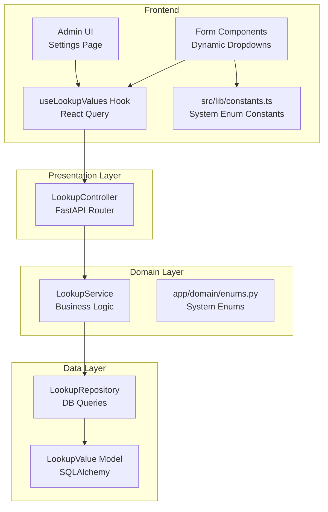
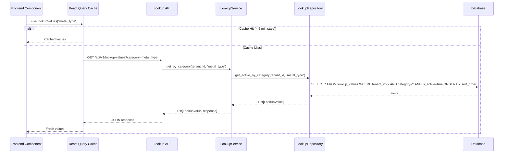
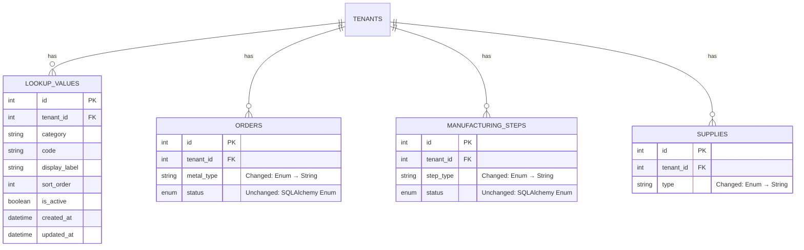

# Design Document: Tenant Lookup Values

## Overview

This feature introduces a hybrid enum management system that splits enums into two categories:

1. **System enums** (remain in code): `OrderStatus`, `StepStatus`, `ShipmentStatus` — these drive application branching logic (if/switch) and stay as Python enums and hardcoded frontend constants.
2. **Configurable enums** (move to DB): `MetalType`, `StepType`, `SupplyType` — these are label/category values with no branching logic. They become tenant-scoped rows in a `lookup_values` database table.

The system follows the existing clean architecture pattern (presentation → domain → data) and multi-tenant isolation pattern (all queries filtered by `tenant_id` from JWT).

### Key Design Decisions

- **Soft delete over hard delete**: Lookup values are deactivated (`is_active = false`) rather than deleted, preserving referential integrity with existing orders/supplies/steps that reference those values.
- **String columns over Enum columns**: Configurable enum columns are migrated from SQLAlchemy `Enum` type to `String` type, since values are now dynamic and tenant-specific.
- **Code immutability**: Once a lookup value's `code` is created, it cannot be changed. This prevents breaking references in existing records. Only `display_label`, `sort_order`, and `is_active` are mutable.
- **Seeding via service function**: Default values are seeded through a `LookupService.seed_defaults()` method that is idempotent and can be called during tenant creation or as a standalone migration step for existing tenants.

## Architecture

The feature follows the existing clean architecture layers:



### Request Flow



## Components and Interfaces

### Backend Components

#### 1. LookupValue Model (`app/data/models/lookup_value.py`)

```python
class LookupValue(Base):
    __tablename__ = "lookup_values"
    __table_args__ = (
        UniqueConstraint("tenant_id", "category", "code", name="uq_tenant_category_code"),
    )

    id: int              # Primary key
    tenant_id: int       # FK to tenants.id
    category: str        # e.g., "metal_type", "step_type", "supply_type"
    code: str            # UPPER_CASE identifier, e.g., "GOLD_24K"
    display_label: str   # Human-readable, e.g., "Gold 24K"
    sort_order: int      # Default 0, for ordering in dropdowns
    is_active: bool      # Default True, soft delete flag
    created_at: datetime
    updated_at: datetime
```

#### 2. LookupRepository (`app/data/repositories/lookup_repository.py`)

Extends `BaseRepository[LookupValue]`. Key methods:

- `get_active_by_category(tenant_id, category) -> List[LookupValue]` — Returns active values for a category, ordered by `sort_order`.
- `get_all_by_category(tenant_id, category, include_inactive) -> List[LookupValue]` — Returns all values, optionally including inactive.
- `get_by_code(tenant_id, category, code) -> Optional[LookupValue]` — Finds a specific value by its unique key.
- `get_all_grouped(tenant_id, include_inactive) -> Dict[str, List[LookupValue]]` — Returns all values grouped by category.
- `code_exists(tenant_id, category, code) -> bool` — Checks for duplicate code within tenant+category.

#### 3. LookupService (`app/domain/services/lookup_service.py`)

Business logic layer. Key methods:

- `get_by_category(tenant_id, category, include_inactive) -> List[LookupValueResponse]`
- `get_all_grouped(tenant_id, include_inactive) -> Dict[str, List[LookupValueResponse]]`
- `create_lookup_value(data, tenant_id) -> LookupValueResponse` — Validates uniqueness, normalizes code to UPPER_CASE.
- `update_lookup_value(id, data, tenant_id) -> LookupValueResponse` — Prevents code/category changes.
- `deactivate_lookup_value(id, tenant_id) -> LookupValueResponse` — Soft delete.
- `validate_lookup_code(tenant_id, category, code) -> bool` — Used by other services to validate configurable enum values.
- `seed_defaults(tenant_id) -> None` — Idempotent seeding of default values for a tenant.

#### 4. LookupController (`app/presentation/api/v1/controllers/lookup_controller.py`)

REST endpoints:

| Method | Path | Description |
|--------|------|-------------|
| GET | `/api/v1/lookup-values` | List values (optional `category` and `include_inactive` query params) |
| POST | `/api/v1/lookup-values` | Create a new lookup value |
| PUT | `/api/v1/lookup-values/{id}` | Update display_label, sort_order, is_active |
| DELETE | `/api/v1/lookup-values/{id}` | Soft delete (set is_active=false) |
| POST | `/api/v1/lookup-values/seed` | Seed defaults for current tenant (admin only) |

#### 5. System Enums File (`app/domain/enums.py`)

Centralizes all system enums that remain in code:

```python
import enum

class OrderStatus(str, enum.Enum):
    PENDING = "PENDING"
    IN_PROGRESS = "IN_PROGRESS"
    COMPLETED = "COMPLETED"
    SHIPPED = "SHIPPED"
    CANCELLED = "CANCELLED"

class StepStatus(str, enum.Enum):
    IN_PROGRESS = "IN_PROGRESS"
    COMPLETED = "COMPLETED"
    FAILED = "FAILED"

class ShipmentStatus(str, enum.Enum):
    PREPARING = "PREPARING"
    SHIPPED = "SHIPPED"
    IN_TRANSIT = "IN_TRANSIT"
    DELIVERED = "DELIVERED"
    RETURNED = "RETURNED"
```

Model files (`order.py`, `manufacturing_step.py`, `shipment.py`) import from this central location instead of defining enums inline.

#### 6. Pydantic Schemas (`app/schemas/lookup_value.py`)

```python
class LookupValueCreate(BaseModel):
    category: str          # Required, validated non-empty
    code: str              # Required, validated non-empty, auto-uppercased
    display_label: str     # Required, validated non-empty
    sort_order: int = 0

class LookupValueUpdate(BaseModel):
    display_label: Optional[str] = None
    sort_order: Optional[int] = None
    is_active: Optional[bool] = None

class LookupValueResponse(BaseModel):
    id: int
    tenant_id: int
    category: str
    code: str
    display_label: str
    sort_order: int
    is_active: bool
    created_at: datetime
    updated_at: datetime

    class Config:
        from_attributes = True
```

### Frontend Components

#### 1. Lookup API Functions (`src/lib/api.ts`)

```typescript
// New API functions added to existing api.ts
fetchLookupValues(category?: string, includeInactive?: boolean): Promise<LookupValue[]>
createLookupValue(data: LookupValueCreate): Promise<LookupValue>
updateLookupValue(id: number, data: LookupValueUpdate): Promise<LookupValue>
deleteLookupValue(id: number): Promise<void>
seedLookupDefaults(): Promise<void>
```

#### 2. Custom Hook (`src/lib/useLookupValues.ts`)

```typescript
function useLookupValues(category: string) {
    return useQuery({
        queryKey: ['lookup-values', category],
        queryFn: () => fetchLookupValues(category),
        staleTime: 5 * 60 * 1000, // 5 minutes
    });
}
```

#### 3. System Enum Constants (`src/lib/constants.ts`)

Centralizes all system enum option arrays:

```typescript
export const ORDER_STATUS_OPTIONS = [
    { value: 'PENDING', label: 'Pending' },
    { value: 'IN_PROGRESS', label: 'In Progress' },
    { value: 'COMPLETED', label: 'Completed' },
    { value: 'SHIPPED', label: 'Shipped' },
    { value: 'CANCELLED', label: 'Cancelled' },
];

export const STEP_STATUS_OPTIONS = [
    { value: 'IN_PROGRESS', label: 'In Progress' },
    { value: 'COMPLETED', label: 'Completed' },
    { value: 'FAILED', label: 'Failed' },
];

export const SHIPMENT_STATUS_OPTIONS = [
    { value: 'PREPARING', label: 'Preparing' },
    { value: 'SHIPPED', label: 'Shipped' },
    { value: 'IN_TRANSIT', label: 'In Transit' },
    { value: 'DELIVERED', label: 'Delivered' },
    { value: 'RETURNED', label: 'Returned' },
];
```

#### 4. Updated Form Components

`OrderFormModal`, `ManufacturingFormModal`, and `SupplyFormModal` replace hardcoded arrays with the `useLookupValues` hook. System status dropdowns import from `constants.ts`.

#### 5. Admin UI Page (`src/pages/LookupValues.tsx`)

A settings page that displays all categories with their values. Supports add, edit, deactivate, and reactivate operations via modal forms.

### Seed Data Defaults

The following default values are seeded for each new tenant:

| Category | Code | Display Label | Sort Order |
|----------|------|---------------|------------|
| metal_type | GOLD_24K | Gold 24K | 0 |
| metal_type | GOLD_22K | Gold 22K | 1 |
| metal_type | GOLD_18K | Gold 18K | 2 |
| metal_type | GOLD_14K | Gold 14K | 3 |
| metal_type | SILVER_925 | Silver 925 | 4 |
| metal_type | PLATINUM | Platinum | 5 |
| metal_type | OTHER | Other | 6 |
| step_type | DESIGN | Design | 0 |
| step_type | CASTING | Casting | 1 |
| step_type | STONE_SETTING | Stone Setting | 2 |
| step_type | POLISHING | Polishing | 3 |
| step_type | ENGRAVING | Engraving | 4 |
| step_type | QUALITY_CHECK | Quality Check | 5 |
| step_type | FINISHING | Finishing | 6 |
| step_type | OTHER | Other | 7 |
| supply_type | METAL | Metal | 0 |
| supply_type | GEMSTONE | Gemstone | 1 |
| supply_type | TOOL | Tool | 2 |
| supply_type | PACKAGING | Packaging | 3 |
| supply_type | OTHER | Other | 4 |

## Data Models

### Database Schema



### Migration Strategy

The Alembic migration performs these operations:

1. **Create `lookup_values` table** with all columns and the unique constraint on `(tenant_id, category, code)`.
2. **Convert `orders.metal_type`** from `Enum(MetalType)` to `String(50)`.
3. **Convert `manufacturing_steps.step_type`** from `Enum(StepType)` to `String(50)`.
4. **Convert `supplies.type`** from `Enum(SupplyType)` to `String(50)`.
5. **Preserve existing data** — the migration uses `ALTER COLUMN TYPE` which keeps existing string values intact since the Python enums already use string values matching the UPPER_CASE codes.
6. **Drop old enum types** from PostgreSQL after column conversion (PostgreSQL creates custom types for enum columns).

The downgrade path reverses these operations: recreates the enum types, converts columns back, and drops the `lookup_values` table.

**Status columns remain unchanged**: `orders.status` (OrderStatus), `manufacturing_steps.status` (StepStatus), and `shipments.status` (ShipmentStatus) stay as SQLAlchemy Enum types.

### Column Type Changes Summary

| Table | Column | Before | After |
|-------|--------|--------|-------|
| orders | metal_type | `Enum(MetalType)` | `String(50)` |
| orders | status | `Enum(OrderStatus)` | `Enum(OrderStatus)` — no change |
| manufacturing_steps | step_type | `Enum(StepType)` | `String(50)` |
| manufacturing_steps | status | `Enum(StepStatus)` | `Enum(StepStatus)` — no change |
| supplies | type | `Enum(SupplyType)` | `String(50)` |
| shipments | status | `Enum(ShipmentStatus)` | `Enum(ShipmentStatus)` — no change |

## Correctness Properties

*A property is a characteristic or behavior that should hold true across all valid executions of a system — essentially, a formal statement about what the system should do. Properties serve as the bridge between human-readable specifications and machine-verifiable correctness guarantees.*

### Property 1: Tenant Isolation

*For any* two distinct tenants A and B, and any lookup values created for tenant A, querying lookup values as tenant B shall never return any of tenant A's values, and vice versa. Attempting to access a specific lookup value by ID as the wrong tenant shall return a 404 response.

**Validates: Requirements 3.1, 3.3**

### Property 2: Created Values Belong to Authenticated Tenant

*For any* valid lookup value creation request made by an authenticated user, the resulting lookup value's `tenant_id` shall equal the authenticated user's `tenant_id` from the JWT token, regardless of any tenant_id value in the request body.

**Validates: Requirements 3.2**

### Property 3: Seeding Idempotence

*For any* tenant, calling `seed_defaults` N times (where N >= 1) shall produce the same set of lookup values as calling it exactly once. The count of lookup values for that tenant shall not increase after the first call.

**Validates: Requirements 4.6**

### Property 4: Category Filtering Returns Active Values in Sort Order

*For any* tenant and any category, a GET request with that category parameter shall return only lookup values where `is_active = true` and `category` matches the requested category. The returned list shall be ordered by `sort_order` ascending.

**Validates: Requirements 5.1**

### Property 5: Duplicate Code Rejection

*For any* existing lookup value with a given (tenant_id, category, code) triple, attempting to create another lookup value with the same triple shall return a 409 Conflict response, and the total count of lookup values shall remain unchanged.

**Validates: Requirements 1.2, 5.4**

### Property 6: Update Preserves Immutable Fields

*For any* lookup value and any update request, after the update is applied, the `category` and `code` fields shall remain equal to their original values. The `display_label`, `sort_order`, and `is_active` fields shall reflect the values from the update request (if provided).

**Validates: Requirements 5.5, 5.6**

### Property 7: Soft Delete Preserves Record

*For any* lookup value that is deleted via the DELETE endpoint, the record shall still exist in the database with `is_active = false`. The record shall not appear in default GET queries (without `include_inactive`), but shall appear when `include_inactive = true`.

**Validates: Requirements 5.7**

### Property 8: Include Inactive Filter

*For any* tenant with both active and inactive lookup values, a GET request with `include_inactive = true` shall return a superset of the values returned by a GET request without that parameter. Specifically, the inactive-included result set shall contain all active values plus all inactive values.

**Validates: Requirements 5.8**

### Property 9: Whitespace-Only Input Rejection

*For any* string composed entirely of whitespace characters (including empty string), using it as the `code` or `display_label` in a creation request shall result in a 422 Validation Error response, and no new lookup value shall be created.

**Validates: Requirements 5.9, 5.10**

### Property 10: Lookup Validation Consistency

*For any* tenant, category, and code string, the `validate_lookup_code` function shall return `true` if and only if there exists an active lookup value with that exact (tenant_id, category, code) triple in the database. When validation fails, the error message shall contain the rejected code value.

**Validates: Requirements 6.1, 6.2, 6.3, 6.4**

### Property 11: Dropdown Option Mapping

*For any* lookup value returned by the API, when mapped to a dropdown option, the option's `value` attribute shall equal the lookup value's `code` field (UPPER_CASE) and the option's `label` attribute shall equal the lookup value's `display_label` field.

**Validates: Requirements 8.1, 8.2**

## Error Handling

### Backend Error Handling

All errors follow the existing `DomainException` hierarchy:

| Error Scenario | Exception | HTTP Status | Message Pattern |
|---|---|---|---|
| Lookup value not found | `ResourceNotFoundError` | 404 | "LookupValue with id {id} not found" |
| Duplicate code in category | `DuplicateResourceError` | 409 | "LookupValue with code '{code}' already exists in category '{category}'" |
| Invalid code for validation | `ValidationError` | 400 | "Invalid {category} value '{code}'. Valid options: {list}" |
| Empty/whitespace code | Pydantic validation | 422 | "code: field required / must not be blank" |
| Empty/whitespace label | Pydantic validation | 422 | "display_label: field required / must not be blank" |
| Attempt to modify code/category | `ValidationError` | 400 | "Cannot modify code or category of an existing lookup value" |
| Cross-tenant access | `ResourceNotFoundError` | 404 | "LookupValue with id {id} not found" (intentionally same as not found) |

### Frontend Error Handling

- **API fetch failure**: React Query's `isError` state triggers an error message in the dropdown area with a retry button.
- **Form submission failure**: Toast notification with the error message from the API response. The form remains open for correction.
- **409 Conflict on create**: Display the specific error message ("already exists in category") in the form.
- **Network errors**: Axios interceptor handles generic network errors with a toast notification.

## Testing Strategy

### Backend Testing (Python — Pytest + Hypothesis)

**Unit Tests** (specific examples and edge cases):
- Seed defaults creates expected values for each category
- System enums (OrderStatus, StepStatus, ShipmentStatus) have correct values in `app/domain/enums.py`
- Model default values (sort_order=0, is_active=True)
- Migration creates table and converts columns correctly

**Property-Based Tests** (Hypothesis):
- Each correctness property (1–10) implemented as a Hypothesis test
- Minimum 100 examples per property test
- Each test tagged with: `# Feature: tenant-lookup-values, Property {N}: {title}`
- Use `@given` decorator with strategies for generating random lookup value data
- Custom strategies for generating valid categories, codes, and display labels

**Property-Based Testing Library**: `hypothesis` (Python)
- Install: `pip install hypothesis`
- Each correctness property MUST be implemented by a SINGLE property-based test
- Configure `@settings(max_examples=100)` for each test

### Frontend Testing (TypeScript — Jest + fast-check)

**Unit Tests** (React Testing Library):
- `useLookupValues` hook returns data and handles loading/error states
- Form components render dropdown options from API data
- Admin UI renders categories and values
- System enum constants have correct values in `src/lib/constants.ts`

**Property-Based Tests** (fast-check):
- Property 11 (dropdown option mapping) implemented as a fast-check test
- Minimum 100 iterations
- Each test tagged with: `// Feature: tenant-lookup-values, Property 11: Dropdown Option Mapping`

**Property-Based Testing Library**: `fast-check` (TypeScript)
- Install: `npm install --save-dev fast-check`
- Each correctness property MUST be implemented by a SINGLE property-based test
- Configure `fc.assert(property, { numRuns: 100 })` for each test
